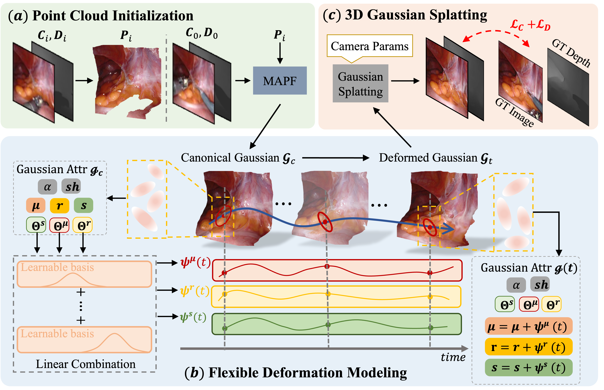

# Deform3DGS: Flexible Deformation for Fast Surgical Scene Reconstruction with Gaussian Splatting

Official code implementation for [Deform3DGS](https://arxiv.org/abs/2405.17835), a Gaussian Splatting based framework for surgical scene reconstruction.

<!--### [Project Page]() -->
> [Deform3DGS: Flexible Deformation for Fast Surgical Scene Reconstruction with Gaussian Splatting](https://arxiv.org/abs/2405.17835) \
> Shuojue Yang, Qian Li, Daiyun Shen, Bingchen Gong, Qi Dou, Yueming Jin \
> MICCAI2024, **Early Accept**

## Demo
### Reconstruction within 1 minute

<!--https://github.com/jinlab-imvr/Deform3DGS/assets/157268160/d58deb50-36ce-4cde-9e65-e3ce8bb851dc-->


https://github.com/jinlab-imvr/Deform3DGS/assets/157268160/7609bfb6-9130-488f-b893-85cc82d60d63


Compared to previous SOTA method in fast reconstruction, our method reduces the training time to **1 minute** for each clip in EndoNeRF dataset, demonstrating remarkable superiority in efficiency.

### Reconstruction of various scenes

<!--<video width="320" height="240" controls>
  <source src="assets/demo_scene.mp4" type="video/mp4">
  Your browser does not support the video tag.
</video>-->
https://github.com/jinlab-imvr/Deform3DGS/assets/157268160/633777fa-9110-4823-b6e5-f5d338e72551


## Pipeline
<!---->
<p align="center">
  
</p>

**Deform3DGS** is composed of (a) Point cloud initialization, (b) Flexible Deformation Modeling, and (c) 3D Gaussian Splatting. Experiments on DaVinci robotic surgery videos indicate the efficacy of our approach, showcasing superior reconstruction fidelity PSNR: (37.90) and rendering speed (338.8 FPS) while substantially reducing training time to only 1 minute/scene.

<!--## Visual Results
<p align="center">
  
</p>-->

## Environment setup
Tested with NVIDIA RTX A5000 GPU.

```bash
git clone https://github.com/jinlab-imvr/Deform3DGS.git
cd Deform3DGS
conda create -n Deform3DGS python=3.7 
conda activate Deform3DGS

pip install -r requirements.txt
pip install -e submodules/depth-diff-gaussian-rasterization
pip install -e submodules/simple-knn
```

## Datasets
We use 6 clips from [EndoNeRF](https://github.com/med-air/EndoNeRF) and 3 clips manually extracted from [StereoMIS](https://zenodo.org/records/7727692) to verify our method. 

To use the two available examples in [EndoNeRF](https://github.com/med-air/EndoNeRF) dataset. Please download the data via [this link](https://forms.gle/1VAqDJTEgZduD6157) and organize the data according to the [guideline](https://github.com/med-air/EndoNeRF.git).

To use the [StereoMIS](https://zenodo.org/records/7727692) dataset, please follow this [github repo](https://github.com/aimi-lab/robust-pose-estimatot.git) to preprocess the dataset and organize the depth, masks, images, intrinsic and extrinsic parameters in the same format as [EndoNeRF](https://github.com/med-air/EndoNeRF). In our implementation, we used [RAFT](https://github.com/princeton-vl/RAFT) to estimate the stereo depth for [StereoMIS](https://zenodo.org/records/7727692) clips.

The data structure is as follows:
```
data
| - endonerf_full_datasets
|   | - cutting_tissues_twice
|   |   | -  depth/
|   |   | -  images/
|   |   | -  masks/
|   |   | -  pose_bounds.npy 
|   | - pushing_soft_tissues
| - StereoMIS
|   | - stereo_seq_1
|   | - stereo_seq_2
```


## Training
To train Deform3DGS with customized hyper-parameters, please make changes in `arguments/endonerf/default.py`. 

To train Deform3DGS, run the following example command:
```
python train.py -s data/endonerf_full_datasets/pulling_soft_tissues --expname endonerf/pulling_fdm --configs arguments/endonerf/default.py 
```

## Testing
For testing, we perform rendering and evaluation separately.

### Rendering
To run the following example command to render the images:

```
python render.py --model_path output/endonerf/pulling_fdm  --skip_train --reconstruct_test --configs arguments/endonerf/default.py
```
Please follow [EndoGaussian](https://github.com/yifliu3/EndoGaussian/tree/master) to skip rendering. Of note, you can also set `--reconstruct_train`, `--reconstruct_test`, and `--reconstruct_video` to reconstruct and save the `.ply` 3D point cloud of the rendered outputs for  `train`, `test` and`video` sets, respectively.

### Evaluation
To evaluate the reconstruction quality, run following command:

```
python metrics.py --model_path output/endonerf/pulling_fdm -p test
```
Note that you can set `-p video`, `-p test`, `-p train` to select the set for evaluation.

## Acknowledgements
This repo borrows some source code from [EndoGaussian](https://github.com/yifliu3/EndoGaussian/tree/master), [4DGS](https://github.com/hustvl/4DGaussians), [depth-diff-gaussian-rasterizer](https://github.com/ingra14m/depth-diff-gaussian-rasterization), [3DGS](https://github.com/graphdeco-inria/gaussian-splatting), and [EndoNeRF](https://github.com/med-air/EndoNeRF). We would like to acknowledge these great prior literatures for inspiring our work.

Thanks to [EndoGaussian](https://github.com/yifliu3/EndoGaussian/tree/master) for their great and timely effort in releasing the framework adapting Gaussian Splatting into surgical scene.

## Citation

If you find this code useful for your research, please use the following BibTeX entries:

```
@misc{yang2024deform3dgs,
      title={Deform3DGS: Flexible Deformation for Fast Surgical Scene Reconstruction with Gaussian Splatting}, 
      author={Shuojue Yang and Qian Li and Daiyun Shen and Bingchen Gong and Qi Dou and Yueming Jin},
      year={2024},
      eprint={2405.17835},
      archivePrefix={arXiv},
      primaryClass={cs.CV}
}

```
### Questions
For further question about the code or paper, welcome to create an issue, or contact 's.yang@u.nus.edu' or 'ymjin@nus.edu.sg'
